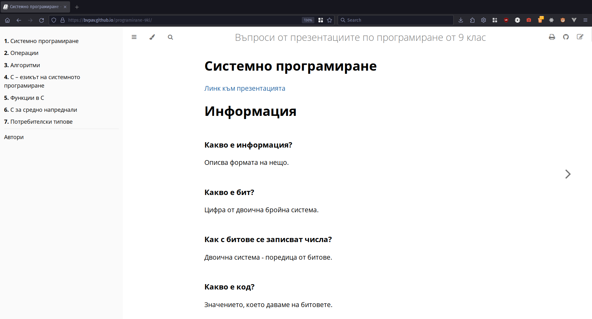

# Програмиране – теория, 9 клас



Тук ще намерите цялата база знания от презентациите с материала по _програмиране – теория_ от 9 клас, приготвени за _[ТУЕС](https://tues.bg)_ от _Иван Георгиев_. Отговорено е на въпросите, изброени в презентациите и има линкове към самите презентации.

> Бележка: Споделените презентации са достъпни само от вашите ученически акаунти.

Сайтът е качен тук:
<https://bvpav.github.io/programirane-9kl>

## Генериране на примерни контролни работи

Може да генерирате примерни контролни в Markdown формат със следната команда:

```sh
$ cat src/*.md | grep '^###' | shuf | head -n 12
```

## Приноси

Всякаква помощ е добре дошла <33

Ако желаете да предложите редакции или допълнения към съдържанието, моля прочетете [наръчника за допринасяне](./CONTRIBUTING.md).

Пълен списък с хората, допринесли за въпросите може да намерите [тук](https://bvpav.github.io/programirane-9kl/avtori.html).
